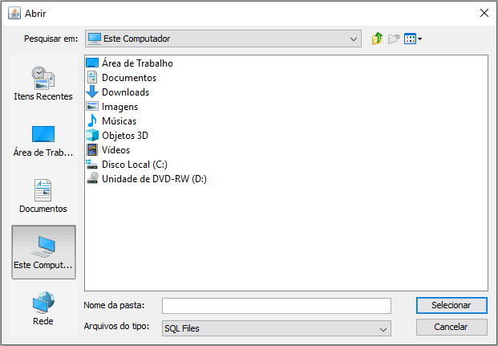

# Ferramentas
**Este campo tem a função de realizar backups ou restaurar dados**
***

## Backup de Dados
**Caso deseja realizar backup dos dados clique na opção e selecione um local para salvar o backup**

***

## Restaurar Dados
**Caso alguns dados tenha perdido, basta restaurá-los com backups antigos**

***

### Criar Banco de Dados
**Caso seja preciso, ou tenha acontecido algum erro, crie um banco de dados**
