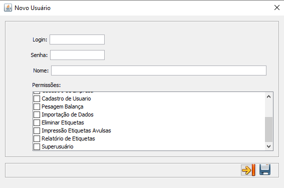

# Manutenção
**Opção que permite o usuario cadastrar itens, embalagens, empresas, usuários e etc...**
***
## Item
**Campo que possibilita vizualizar a listagem de itens e cadastrá-los.**

***
#### **Novo Item**

**Principais Campos e Parâmetros:**

- `Item` - Permite informar o código do item.
- `Descrição` - Permite informar a descrição do item.
- `Código de Barras` - Permite informar o código de barras do item.
- `UN` - Permite informar a unidade de negócio do item.
- `Peso` - Insira o peso do item que está sendo cadastrado.
- `Validade` - Informe a validade do item em dias.
- `Temperatura` - Insira a temperatura média do item.
- `DUN` - Insira o número da  unidade de distribuição
- `Grupo Estoque` - Insira o o número do grupo de estoque deste produto
- `Familia` - Informe a familia em que este produto pertence
- `Comprimento` - Insira o comprimentp do produto
- `Largura` - Informe a largura do item
- `Altura` - Permite inserir a altura do item

***
### Alocar Item x Embalagem

**Selecione um item e clique em editar.**

**Clique em incluir e selecione uma embalagem já cadastrada**   

**Campos para preencher :**

- `Item` - Codigo de identificação do item e sua descrição
- `Embalagem` - Codigo de identificação da embalagem e sua descrição
- `Sigla da Embalagem` - Sigla da embalagem 
- `Quantidade de Itens por Embalagem` - Insira a quantidade de itens por embalagem
- `Peso Diverso` - Informe o peso total

***
## Embalagem
**Campo que a principal função tem como o objetivo de cadastrar embalagens pra itens**

***
### **Nova Embalagem**

**Principais campos para preencher :**

- `Codigo` - Insira um codigo para a identificação da embalagem
- `Descrição` - Permite inserir uma descrição para a caixa  
- `Sigla` - Informe uma sigla para a embalagem
- `Comprimento` - Insira o comprimento do recipiente
- `Largura` - Informe a largura do pacote
- `Altura` - Permite inserir a altura da embalagem
***

## Item x Embalagem
**Campo que permite vizualizar itens que estão alocados a suas embalagens**

***

## Layout Etiqueta
**Campo com a função de cadastrar layouts para etiquetas**

#### **Nova Etiqueta**

**Campos para Preencher :**

- `Descrição` - Insira uma descrição para a identificação da etiqueta
- `Layout` - Informe como será o layout da etiqueta

***
## Empresa
**Campo com a função de cadastrar empresas**

#### **Nova Empresa**

**Principais campos para preencher :**

- `Razão Social` - Insira o nome social da empresa a ser cadastrada
- `Código da Empresa` - Informe o código da empresa
- `Código do Estabelecimento` - Insira o código do estabelecimento
- `Resposável` - Informe o resposável pela a empresa
- `SSCC` - Insira o código de série da unidade logística
- `CNPJ` - Insira o CNPJ da empresa que deseja cadastrar
- `Valida Impressão` - Informe se valida a impressão
- `Quantidade Etiquetas ZPL` - Informe a quantidade de etiquetas
- Estabilização
    - `Imprimir estabilização balança?` - Informe se deseja imprimir uma estabilização da balança
    - `Quantidade de Validação` - Informe a quantidade de validação que deseja imprimir

***
## Usuário
**Campo com a função de cadastrar novos usuários**

#### **Novo Usuário**

**Campos para preencher :**

- `Login` - Insira o nome de usuário para login
- `Senha` - Informe uma senha para o acesso
- `Nome` - Informe o nome completo do usuário
***
1. **Permissões**
    - **Selecione uma função para o usuário**
    - Cadastro de Item
    - Cadastro de Embalagem
    - Relacionamento Item x Embalagem
    - Cadastro de Layout de Etiqueta
    - Cadastro de Empresa
    - Cadastro de Usuário
    - Passagem Balança
    - Importação de Dados
    - Eliminar Etiquetas
    - Impressão de Etiquetas Avulsas
    - Relatório de Etiquetas
    - Superusuário

