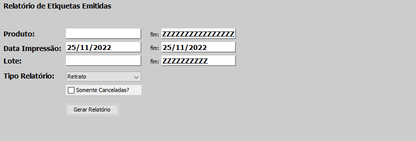

# Relatórios
**Está opção tem a função de gerar um relatório sobre as etiquetas impressas**
***
## Etiquetas Impressas
**Gera relatório de todas as etiquetas já impressas**

**Principais Campos para preencher**

- `Produto` - Nome do produto que deseja realizar o relatório de etiquetas
- `Data de Impressão` - Data de impressão das etiquetas
- `Lote` - Lote de impressão das etiquetas que deseja 
- `Tipo do Relatório` - Selecione um tipo para o relatório| **Retrato, Paisagem e Excel**
- `Somente Canceladas` - Informe se deseja um relatório com apenas as etiquetas canceladas