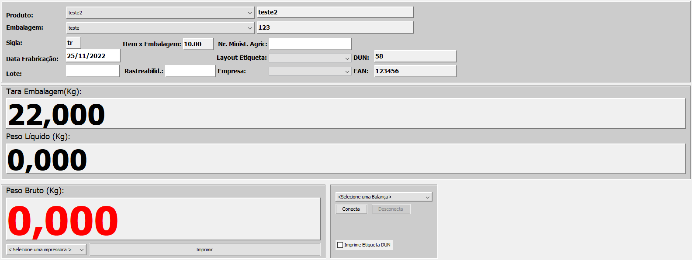
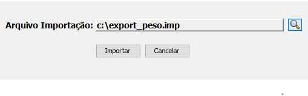
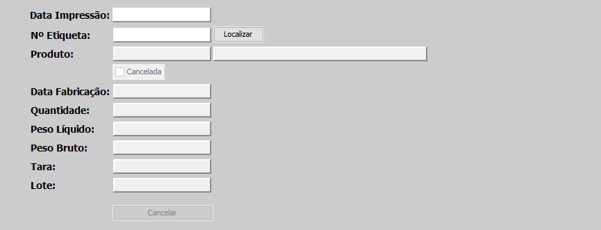
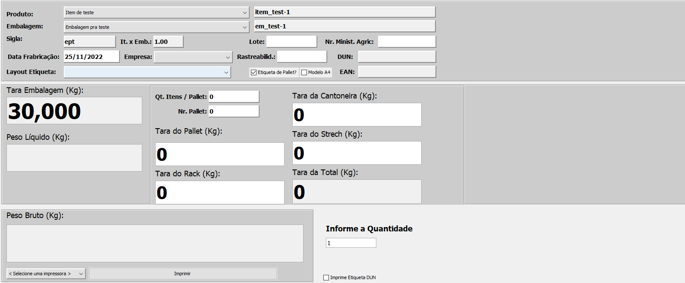

# Tarefas
**Opção que tem a função de se conectar com a balança, importar dados, Imprimir Etiquetas Avulsas e etc..**
***

## Balança
**Campo com a função de se conectar com a balaça e imprimir informações**

**Principais Campos e Parametros :**

- `Produto` - Nome do produto que está na balança
- `Embalagem` - Embalagem que está alocado com o produto
- `Sigla` - Silga da embalagem alocada ao produto
- `Data de Fabricação` - Data de fabricação do produto
- `Lote` - Permite inserir o lote do produto fabricado
- `Item x Embalagem` - Quantidade de itens e embalagens
- `Rastreabilidade` - Permite inserir o código de rastreabilidade
- `Nr. Minist. Agric` - Informe a norma reguladora
- `Layout` - Selecione um layout para a etiqueta
- `Empresa` - Informe a empresa onde a balança está localizada
- `Dun` - Número de unidade de destribuição
- `EAN` - Codigo de barras do produto
***
1. `Tara da Embalagem` - Valor do peso do item mais o valor do peso da embalagem
2. `Peso Liquido` - Peso liquido do produto
3. `Peso Bruto` - Peso total na balança
***

## Importar Dados
**Caso seja preciso importar algum tipo de dado para a balança, basta clicar nesta opção e selecionar o arquivo**

***

## Cancelar Etiquetas
**Caso tenha cadastrado alguma etiqueta não desejada, este campo permite você apaga-lo**

**Principais Campos para preencher**

- `Data de Impressão` - Permite inserir a data de impressão da etiqueta
- `Número da Etiqueta` - Permite inserir o número da etiqueta
- `Produto` - Informe o porduto em que a etiqueta está alocado
- `Data de Fabricação` - Insira Data de fabricação do produto e da etiqueta
- `Quantidade` - Permite informar a quantidade de etiquetas imprimidas
- `Peso Liquido` - Insira o peso liquido do produto e da etiqueta
- `Peso Bruto` - Insira o peso total da etiqueta
- `Tara` - Permite informar o tara da embalagem
- `Lote` - Permite informar qual é o lote da impressão

***

## Imprimir Etiquetas Avulsas
**Campo com a função de imprimir etiquetas para para a identificação de produtos**

**Principais Campos e Paramentro**

- `Produto` - Nome do produto que a etiqueta será alocada
- `Embalagem` - Nome da embalagem que está alocado ao produto
- `Sigla` - Sigla da embalagem alocada ao produto
- `Data de Fabricação` - Data de fabricação das etiquetas 
- `Item x Embalagem`- Quantidade de itens por embalagens
- `Empresa` - Empresa do produto
- `Layout da Etiqueta` - Selecione um layout para a impressão da etiqueta
- `Lote` - Informe o lote da produção
- `Rastreabilidade` - Insira o codigo de rastreabilidade
- `Nr. Minist. Agric` - Informe a norma reguladora
- `DUN` - Insira Número de unidade de distribuição
- `EAN` - Informe Codigo de barra do produto
***
1. `Tara da Embalagem` - Valor do peso da embalagem mais o peso basico do produto
2. `Peso Liquido` - Peso liquido do produto
3. `Peso Bruto` - Peso total
4. `Quantidade` - Quantidade de etiquetas que deseja imprimir
***
1. Imprimir Etiqueta para Pallet
    - **Caso queira que a etique seja para pallet assinale a opção**
    - `Quantidades de Itens por Pallet` - Insira a quantide de itens por pallets
    - `Nr. Pallet` - Insira o Nr. do pallet 
    - `Tara do Pallet` - Insira a tara do pallet
    - `Tara do Rack` - Informe a tara do pallet
    - `Tara da Cantoneira` - Permite inserir a tara da cantoneira
    - `Tara de Strech` - Permite inserir a tara do strech
    - `Tara Total` - Permite inserir a tara total

**!!OBS: O Sistema não identifica impressoras que não tiverem o nome zebra**